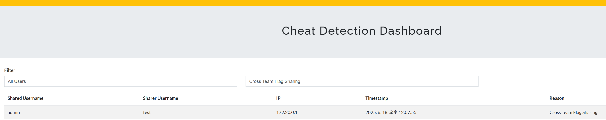
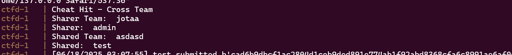
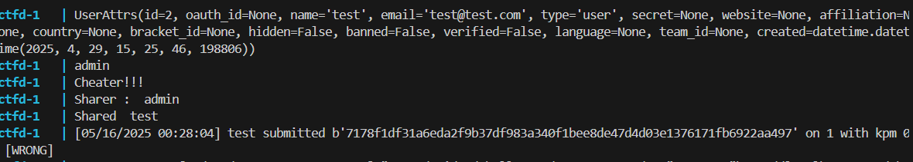

# CTFd CheatDetecter Plugin

A powerful plugin for CTFd that detects and logs flag sharing and cheating attempts. Supports both team and individual modes, providing real-time detection and an admin dashboard for monitoring.

## 🎯 Features

- **Real-time Flag Sharing Detection**: Automatically detects when flags are shared between different users or teams
- **Cross-team Cheating Prevention**: Identifies flag sharing between different teams in team mode
- **Individual Mode Support**: Works in both individual and team competition modes
- **Comprehensive Logging**: Records detailed information about cheating attempts including:
  - Username of the person who originally solved the challenge
  - Username of the person who used the shared flag
  - Team information for both users
  - IP address of the cheating attempt
  - Timestamp of the incident
  - Reason for the detection
- **Admin Dashboard**: Web-based interface for administrators to monitor cheating attempts
- **API Integration**: RESTful API for programmatic access to cheat detection data
- **Dynamic Flag Support**: Works with dynamic flags generated by container-based challenges

## 📸 Screenshots

### Console Detection Logs

*Real-time flag sharing detection logs*

### Admin Dashboard

*Admin dashboard for reviewing all detected cheating attempts*

### Team Mode

*Cheating logs in team mode*

### Individual Mode

*Cheating logs in individual mode*

---

## 🏆 Team vs Individual Mode

- **Team Mode**: Containers and flags are managed per team. Submitting another team's flag is logged as cheating.
- **Individual Mode**: Containers and flags are managed per user. Submitting another user's flag is logged as cheating.

## 🚀 Installation

1. **Clone or Download**: Place the `cheatDetecter` folder in your CTFd `plugins` directory:
   ```
   CTFd/plugins/cheatDetecter/
   ```

2. **Database Migration**: The plugin will automatically create the necessary database tables when CTFd starts.

3. **Restart CTFd**: Restart your CTFd instance to load the plugin.

## 📋 Requirements

- CTFd 3.0.0 or higher
- Python 3.7+
- Flask-SQLAlchemy
- Admin privileges for dashboard access

## 🔧 Configuration

The plugin is configured through `config.json`:

```json
{
    "name": "cheatDetector",
    "route": "/detecter/dashboard"
}
```

## 🎮 Usage

### For Administrators

1. **Access Dashboard**: Navigate to `/detecter/dashboard` in your CTFd admin panel
2. **View Cheating Attempts**: The dashboard displays all detected cheating attempts in a table format
3. **Filter Data**: Use the filter dropdowns to search by specific users or reasons
4. **API Access**: Use `/detecter/api/cheat_data` endpoint to programmatically access cheat detection data

### Dashboard Features

- **Real-time Updates**: Data is fetched via AJAX for real-time updates
- **Filtering**: Filter by username or cheating reason
- **Timestamp Formatting**: Human-readable timestamps for all incidents
- **Responsive Design**: Works on desktop and mobile devices

### API Endpoints

#### GET `/detecter/api/cheat_data`
Returns JSON data of all cheating attempts:

```json
[
    {
        "shared_username": "user_who_used_flag",
        "sharer_username": "user_who_solved_challenge",
        "shared_team": "team_of_user_who_used_flag",
        "sharer_team": "team_of_user_who_solved_challenge",
        "cheat_ip": "192.168.1.100",
        "timestamp": 1640995200,
        "reason": "Cross Team Flag Sharing"
    }
]
```

## 🔍 How It Works

### Detection Algorithm

1. **Flag Submission**: When a user submits a flag, the plugin intercepts the submission
2. **Database Lookup**: Checks if the submitted flag exists in the `DynamicFlag` table
3. **User Comparison**: Compares the current user with the original solver
4. **Team Verification**: In team mode, verifies if users belong to different teams
5. **Cheat Logging**: If cheating is detected, logs the incident and blocks the submission

### Database Schema

#### DynamicFlag Table
- `id`: Primary key
- `created_flag`: The flag that was generated
- `container_id`: Associated container ID (for container-based challenges)
- `challenge_id`: Challenge ID
- `team_id`: Team ID (nullable for individual mode)
- `user_id`: User ID of the original solver
- `user_ip`: IP address of the original solver

#### cheatList Table
- `id`: Primary key
- `shared_username`: Username of the person who used the shared flag
- `sharer_username`: Username of the person who originally solved the challenge
- `shared_team`: Team name of the person who used the shared flag
- `sharer_team`: Team name of the person who originally solved the challenge
- `cheat_ip`: IP address of the cheating attempt
- `timestamp`: Unix timestamp of the incident
- `reason`: Description of the cheating type

## 🛡️ Security Features

- **IP Tracking**: Records IP addresses for both original solvers and cheating attempts
- **Team Isolation**: Prevents cross-team flag sharing in team competitions
- **Individual Protection**: Detects flag sharing in individual competitions
- **Admin-only Access**: Dashboard and API access restricted to administrators
- **Audit Trail**: Complete logging of all cheating attempts for investigation

## 🔧 Integration with Other Plugins

The cheatDetecter plugin integrates seamlessly with:
- **Container Plugin**: Works with dynamic flags generated by container-based challenges
- **Dynamic Challenges Plugin**: Compatible with dynamic challenge types
- **Team Management**: Supports both individual and team competition modes

## 🐛 Troubleshooting

### Common Issues

1. **Plugin Not Loading**: Ensure the plugin folder is in the correct location and CTFd has been restarted
2. **Dashboard Not Accessible**: Verify you have admin privileges
3. **Database Errors**: Check that CTFd has proper database permissions
4. **False Positives**: Review the detection logic if legitimate flag sharing is being flagged

## 🤝 Contributing

1. Fork the repository
2. Create a feature branch
3. Make your changes
4. Test thoroughly
5. Submit a pull request

## 📄 License

This plugin is released under the same license as CTFd.

## 🆘 Support

For issues and questions:
1. Check the troubleshooting section above
2. Review CTFd documentation
3. Open an issue on the repository
4. Contact the plugin maintainer

## 🔄 Version History

- **v1.0.0**: Initial release with basic cheat detection
- **v1.1.0**: Added admin dashboard and API endpoints
- **v1.2.0**: Enhanced filtering and UI improvements
- **v1.3.0**: Added support for dynamic flags and container integration

---

**Note**: This plugin is designed to help maintain fair play in CTF competitions. Use responsibly and ensure your competition rules are clearly communicated to participants.

## 🐳 Docker Monitor Flag Generation

The `generate_flag_from_container` function in `docker_monitor.py` creates a flag by hashing the container ID with a string seed:

```python
def generate_flag_from_container(container_id):
    concat_str = str(container_id) + str("<flag_seed>")
    return hashlib.sha256(concat_str.encode()).hexdigest()
```
- **Note:** The default is `tmp`, but for real competitions, use a unique string (e.g., a per-challenge secret) for `<flag_seed>` to enhance security.

## 🏷️ Container Label Guidelines

When creating containers, you must add the following labels:
- `ctfd_user_id`: User ID
- `ctfd_challenge_id`: Challenge ID
- `ctfd_team_id`: Team ID (only for team mode)
- `ctfd_user_ip`: User IP

Example (docker-compose):
```yaml
labels:
  - "ctfd_user_id=1"
  - "ctfd_challenge_id=2"
  - "ctfd_team_id=3"
  - "ctfd_user_ip=127.0.0.1"
```

## 📋 Additional Notes
- The admin dashboard is provided via the `cheat_dashboard.html` template.
- The plugin supports both team and individual modes, with real-time logs and API access.

---

**For questions or issues, please contact the administrator or use the GitHub issue tracker.**
